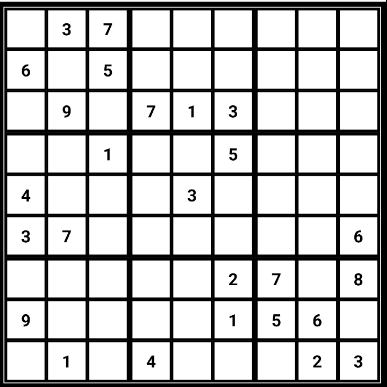
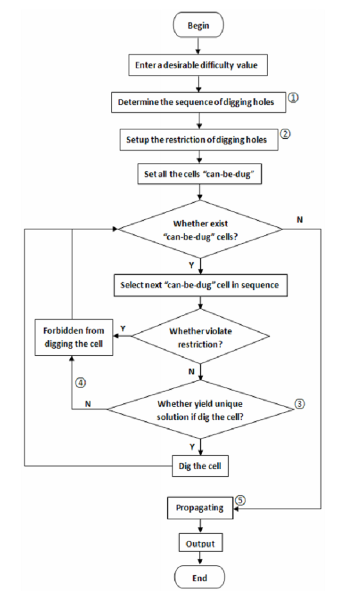
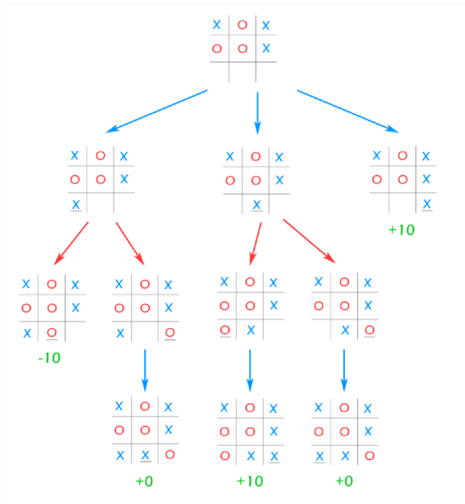

# Bored Games

Bored games is an Android application implementing the popular games Sudoku and TicTacToe.

## Sudoku

    

The boards generated by this program all have a unique solution. The algorithm used for the generation of the boards is inspired by the paper [Sudoku Puzzles Generating: from Easy to Evil](http://zhangroup.aporc.org/images/files/Paper_3485.pdf). This flowchart visually explains the procedure.

    

First, we start with a valid finished state game. The difficulty level determines the total minimum number of given entries, and the minimum number of given entries per row and column. We can then check if removing an entry will lead to a unique solution by testing all other 8 possibilities in that entry and attempting a solve with a recursive backtracking algorithm. If any of these solves are succesful, removing this entry would not lead to a unique solution. We then continue until no other entries can be removed.

## TicTacToe

    

A basic artificial intelligence is implemented to play Sudoku against the user. It uses the minmax algorithm by traversing a game tree to determine which next move is the best.

    

Each leaf has a score: +10 for a win, -10 for a loss and 0 for a tie. The score of the higher nodes is the sum of the score of the children. At each turn, the bot will play the move taking the game to the node with the highest score. This pattern makes a perfect and unbeatable opponent.